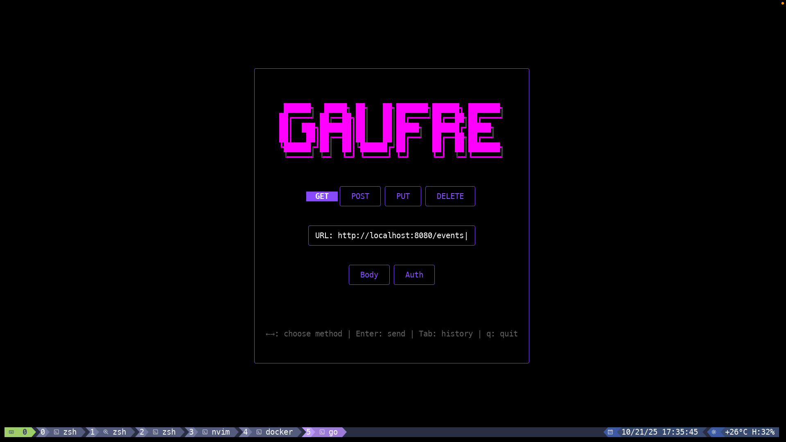

# Gaufre

A terminal-based API client built with Go and Bubble Tea. 
Designed for developers who live in the terminal.
Works seamlessly with tmux and neovim workflows.

## Screenshot



## Features

- **Multiple HTTP methods** - GET, POST, PUT, DELETE
- **Request history** - Saved locally with fuzzy search
- **Authentication support** - Bearer token authentication
- **JSON syntax highlighting** - Response formatting
- **Scrollable responses** - Handle large API responses
- **Request editor** - Multiline JSON body editing
- **Persistent storage** - History saved between sessions

## Installation
```bash
git clone https://github.com/Etienne-55/gaufre.git
cd gaufre
go build -o gaufre
```

## Usage
```bash
./gaufre
```

### Keyboard Shortcuts

**Main Screen:**
- `↑↓` - Navigate between method selector and URL
- `←→` - Change HTTP method
- `Enter` - Send request
- `Tab` - Open history
- `q` - Quit

**URL Input:**
- Type to edit URL
- `Home/End` - Move to start/end
- `↑` - Back to method selector
- `↓` - Go to request editor

**Request Editor:**
- `←→` - Switch between Body and Auth tabs
- `Enter` - Open selected editor
- `↑` - Back to main screen

**History:**
- `/` - To filter requests 
- `↑↓` - Navigate
- `Enter` - Load request
- `Esc` - Close history

**Response Viewer:**
- `↑↓` or `j/k` - Scroll
- `Enter/Esc` - Back to main screen

## Configuration

History is stored in:
- **Linux/macOS:** `~/.url_history.json`
- **Windows:** `%USERPROFILE%\.url_history.json`

Maximum history items: 100 (configurable in `internal/storage/history.go`)

## Technologies

- [Bubble Tea](https://github.com/charmbracelet/bubbletea) - TUI framework
- [Lipgloss](https://github.com/charmbracelet/lipgloss) - Styling
- [Bubbles](https://github.com/charmbracelet/bubbles) - TUI components

## Development
```bash
# Run
go run .

# Build
go build -o gaufre
